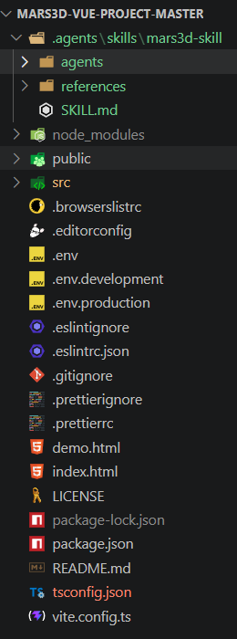
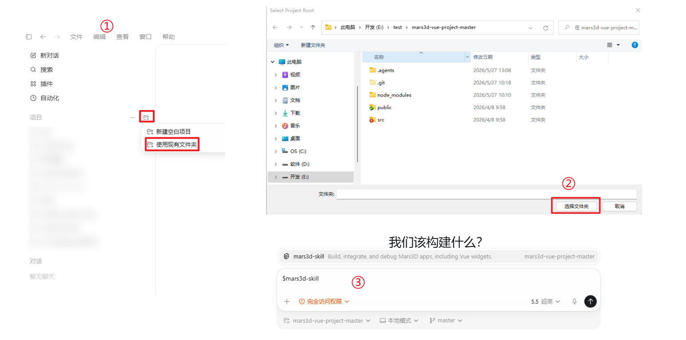
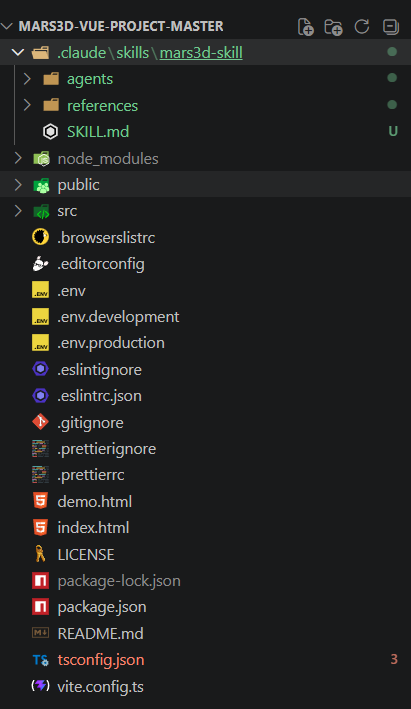
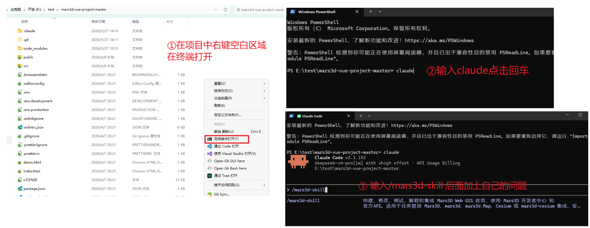
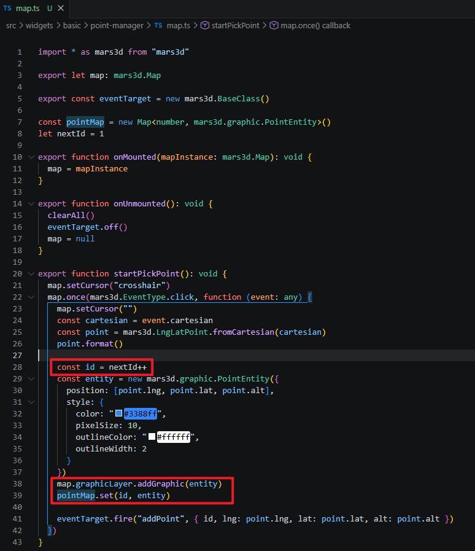
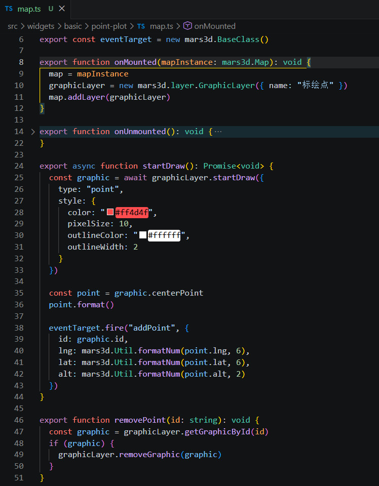
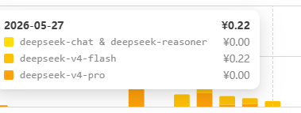

# Mars3D Skill

这是一个用于 AI coding agent 的 Mars3D 专用 skill，面向 Mars3D Web GIS 项目的开发、集成、调试和经验复用。

它会帮助 Codex 或 Claude Code 在处理 Mars3D 项目时优先读取本地项目代码、已安装 SDK 类型声明、Mars3D 官方文档和仓库内沉淀的工程经验，尤其适合 Vue/ES5 技术栈、Mars3D widget 机制、安装集成问题和常见 API 使用错误。

当前skill还在逐步完善中，如果当前skill不满足您的需求，也可以自行修改内容，后续我们会添加更多内容，也期待您的加入。

## 主要能力

- 分析和修改 Mars3D 项目代码。
- 排查 npm、静态文件、CDN 等 Mars3D 集成问题。
- 处理 `mars3d-cesium`、Cesium 资源路径、地图空白、打包失败等常见问题。
- 根据 `mars3d.d.ts` 和官方 API 页面确认 class、method、option 的正确用法。
- 支持 Mars3D Vue widget 机制经验：`widget-store.ts`、`index.vue`、`map.ts`、`useLifecycle(mapWork)`。
- 记录 Vue 工程实践：页面数据只保存业务状态和 graphic id，不把 Mars3D/Cesium 对象放进深度响应式状态。
- 提供常用代码模式，例如 `GraphicLayer`、`startDraw`、`centerPoint`、layer cleanup 等。

## 目录结构

```text
mars3d-skill/
├── README.md
├── images
└── mars3d-skill(下载这个文件夹放到项目中即可使用)/
    ├── SKILL.md
    ├── agents/
    │   └── openai.yaml
    └── references/
        ├── api-errors.md
        ├── api-navigation.md
        ├── coding-patterns.md
        ├── integration.md
        ├── integration-cdn.md
        ├── integration-npm.md
        ├── integration-static.md
        ├── vue-engineering-practices.md
        └── widget-patterns.md
```

内层 `mars3d-skill/SKILL.md` 是 skill 入口，负责描述触发条件、工作流程和 reference 选择规则。

内层 `mars3d-skill/references/` 中存放按需加载的经验文档。文档采用“中文经验说明 + 英文 API 术语”的形式，保留 `Mars3D`、`GraphicLayer`、`startDraw`、`centerPoint`、`widget-store.ts` 等关键术语，便于和代码、类型声明、官方 API 对齐。

## 在 Codex 中按项目使用

这部分介绍的是“在目标 Mars3D 项目根路径使用这个 skill”，不是安装到用户全局 skill 目录。Codex 当前推荐的项目级 skill 目录是目标项目根目录里的 `.agents/skills`，例如 `E:\your-mars3d-project\.agents\skills`。

skill 的调用名来自 `SKILL.md` 里的 `name: mars3d-skill`，所以显式调用时使用 `$mars3d-skill`。

### 1. 复制到项目根目录的 `.agents/skills`

目标结构应类似：

```text
E:\your-mars3d-project\.agents\skills\mars3d-skill\SKILL.md
E:\your-mars3d-project\.agents\skills\mars3d-skill\references\...
E:\your-mars3d-project\.agents\skills\mars3d-skill\agents\openai.yaml
```

这里的 `.agents/skills` 是 Codex 扫描项目级 skills 的目录；skill 内部的 `agents/openai.yaml` 是 Codex app 的可选展示元数据，不是另一个项目配置目录。

这里使用[项目模板](https://gitee.com/marsgis/mars3d-vue-project)举例
复制过后的项目结构如下



### 2. 在项目根目录添加 `AGENTS.md` (可选)

`AGENTS.md` 不是 skill 安装目录，它只是给 Codex 的项目说明。建议在目标 Mars3D 项目根路径中新建或更新 `AGENTS.md`：

```md
# AGENTS.md

## Mars3D 项目约定

- 本项目是 Mars3D Web GIS 项目。
- 处理 Mars3D、mars3d.Map、config.json、GraphicLayer、widget、useLifecycle(mapWork)、mars3d-cesium、地图空白、安装集成、添加 Mars3D 地图相关功能和 API 参数问题时，优先使用本项目 `.agents/skills/mars3d-skill` 中的 `$mars3d-skill`。
- 修改地图联动功能前，先判断项目是否使用 Mars3D Vue widget 机制。
- 在 Vue 项目中，不要把 Mars3D/Cesium 对象实例放进深度响应式状态；页面状态只保存业务字段和 graphic id。
- 绘制点后读取坐标时，优先使用 `graphic.centerPoint`，不要假设 `graphic.position.lng` 或 `graphic.position.lat` 存在。
```

### 3. 从项目根路径启动 Codex

启动后，Mars3D 相关任务可以显式调用。如果 `$mars3d-skill` 没出现在 skill 选择器里，重启 Codex，并确认当前工作目录在目标项目内。

```text
$mars3d-skill 帮我分析这个 Mars3D Vue 项目是否使用 widget 机制
```

```text
$mars3d-skill 帮我排查这个项目为什么 npm run build 后地图空白
```

```text
$mars3d-skill 帮我新增一个 Mars3D widget，点击按钮后在地图上绘制点，并把点记录同步到表格
```

实际使用如下



## 在 Claude Code 中使用

Claude Code 支持项目级 skills。推荐把这个 skill 放到目标 Mars3D 项目根目录的 `.claude/skills/mars3d-skill/` 下。这样该 skill 只对当前项目生效，也方便随项目提交给团队。

### 1. 复制到项目级 `.claude/skills`

目标结构应类似：

```text
E:\your-mars3d-project\.claude\skills\mars3d-skill\SKILL.md
E:\your-mars3d-project\.claude\skills\mars3d-skill\references\...
```

这里使用[项目模板](https://gitee.com/marsgis/mars3d-vue-project)举例
复制过后的项目结构如下



Claude Code 的命令名来自 skill 目录名，所以这个项目里可以用：

```text
/mars3d-skill 帮我判断这个项目是否使用 Mars3D Vue widget 机制
```

Claude Code 也会根据 `SKILL.md` 的 `description` 在相关任务中自动加载该 skill。

实际使用如下


### 2. 在项目根目录添加 `CLAUDE.md`（可选）

如果希望 Claude Code 每次进入项目时都知道这是 Mars3D 项目，可以在项目根目录添加 `CLAUDE.md`：

```md
# CLAUDE.md

本项目是 Mars3D Web GIS 项目。

处理 Mars3D、mars3d.Map、config.json、GraphicLayer、widget、useLifecycle(mapWork)、mars3d-cesium、地图空白、安装集成和 API 参数问题时，优先使用 `/mars3d-skill` skill。

重要约定：

- 修改地图联动功能前，先判断项目是否使用 Mars3D Vue widget 机制。
- Vue 页面状态只保存业务字段和 graphic id，不保存 Mars3D/Cesium 对象实例。
- 绘制点后读取坐标时，优先使用 `graphic.centerPoint`。
```

项目级 `CLAUDE.md` 适合放团队共享的项目规则；个人偏好可以放到 `CLAUDE.local.md`。

## 选择建议

- Codex 按项目使用：复制到目标项目本地 `.agents/skills/mars3d-skill`，必要时添加 `AGENTS.md`，从项目根路径启动 Codex。
- Claude Code 项目内使用：复制到项目 `.claude/skills/mars3d-skill`，必要时添加 `CLAUDE.md`。
- 不建议只复制 `SKILL.md`，因为它会按任务加载 `references/` 中的经验文档。

## 适用场景

- Mars3D 项目功能开发。
- Mars3D Vue widget 架构改造。
- Mars3D 安装集成和打包部署排查。
- API 参数无效、方法调用报错、类名或枚举名不确定。
- 图层、矢量对象、绘制编辑、坐标转换、地图事件、相机控制等常见 Web GIS 功能。

## 有无skill的对比
这里使用[项目模板](https://gitee.com/marsgis/mars3d-vue-project)举例
下面是我使用claude code v2.1.152  模型使用的deepseek-v4-flash 相同的提示词
```
E:\test\mars3d-vue-project-master\src\widgets\basic\toolbar\index.vue 在这个文件中的这段代码
    children: [
        { name: "坐标定位", icon: "local", widget: "location-point" }
    ]，加上一个按钮，点击之后会出现一个弹窗，这个弹窗中上面是一个按钮，下面是一个表格。点击按钮之后可以在地图上标绘
  点，每标绘一个点，就会在表格中增加这个点的记录，每个记录后面有一个删除按钮，点击删除，记录从表格中删除同时地图上的点
  也会被删除
```

- 不使用skill

可以看见，这里的id是自己生成的，并不是矢量数据自己的id，生成之后也是直接通过map.graphicLayer.addGraphic,而不是新建一个graphicLayer,也没有使用startDraw


- 使用skill

提示词前面加上 "/mars3d-skill 使用这个skill，"


对比可以发现，虽然功能都实现了，但是使用skill生成的代码，更符合我想要的样子

## token消耗
这里使用的是claude code v2.1.152  模型使用的deepseek-v4-flash。算上第一次测试，加上后面两次写案例截图，三次相同的提示词总共花费0.22元(实际费用会受到需求难度，提示词的影响)




## 参考资料

- Codex skills 使用方式：`https://developers.openai.com/codex/skills`
- Codex `AGENTS.md` 项目说明：`https://developers.openai.com/codex/guides/agents-md`
- Claude Code skills：`https://docs.claude.com/en/docs/claude-code/skills`
- Claude Code `CLAUDE.md` memory：`https://docs.claude.com/en/docs/claude-code/memory`
